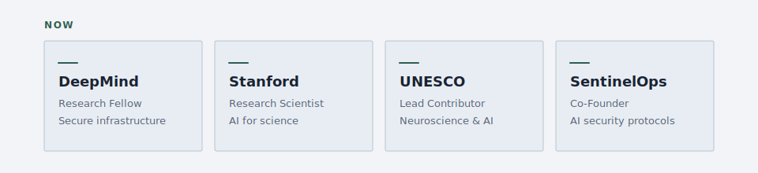

<!-- Content source of truth: profile.yaml (synced with https://mateopetel.xyz/) -->

Work at the intersection of **AI**, **scientific discovery**, and **safety-critical systems** — accelerating the scientific process while preserving reliability and rigor.

[Website](https://mateopetel.xyz/) · [LinkedIn](https://www.linkedin.com/in/mateo-petel/) · [Email](mailto:mpetel@stanford.edu)

### Now

- [DeepMind](https://www.deepmind.com/) — Research Fellow, scaling secure infrastructure
- [Stanford](https://www.stanford.edu/) — Research Scientist, AI for science
- [UNESCO](https://www.unesco.org/) — Lead Contributor, neuroscience and AI governance
- [SentinelOps](https://github.com/SentinelOps-CI) — Co-Founder, open-source AI security protocols

### Selected work

[SentinelOps](https://github.com/SentinelOps-CI) — open-source AI security protocols for trustworthy advanced systems.

[Accountability Layer](https://github.com/fraware/accountabilitylayer) — transparency and traceability for AI agent decision-making.

[Inter-Sim RL](https://github.com/fraware/inter-sim-rl) — intersection navigation with reinforcement learning under constraints.

[DeepLiDARPlanet](https://github.com/fraware/DeepLiDARPlanet) — biomass estimation from airborne and spaceborne imagery (JPL lineage).

[Lean Verifier](https://github.com/fraware/leanverifier) — specify and prove ML properties in Lean 4.

### Selected research

- Evaluated early-warning systems for LLM-aided biological threat creation at [OpenAI](https://openai.com/index/red-teaming-network/).
- Built extreme-weather forecasting models analyzing mortality impacts at Oxford — published in [*The Lancet*](https://www.thelancet.com/journals/lanplh/article/PIIS2542-5196(25)00251-7/fulltext).
- Optimized clinical operations at Lucile Packard Children's Hospital (Stanford), cutting runtime 4x.
- Developing verified ML pipelines in Lean 4 with [CNRS](https://lmf.cnrs.fr), focused on specification and proof automation.
- Lead contributor to UNESCO's report on neuroscience and AI governance.

Languages

---

Full CV and writing: [mateopetel.xyz](https://mateopetel.xyz/)